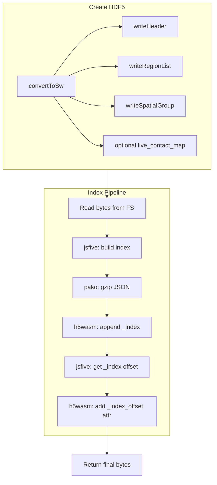

# Add HDF5 Indexing to SWTool

## Goal

Incorporate the indexing logic from [hdf5-indexer](hdf5-indexer/) into [swtool](swtool/) so that converted `.sw` files include a `_index` dataset and `_index_offset` root attribute. This enables [hdf5-indexed-reader](https://github.com/jrobinso/hdf5-indexed-reader) to load individual datasets via HTTP range requests without traversing the HDF5 object tree.

## Architecture




## Index Format (Python compatibility)

- **Structure**: `{ "/path/to/group": { "child1": offset, "child2": offset }, ... }`
- **Storage**: Gzipped JSON in top-level dataset `_index`
- **Attribute**: Root `_index_offset` = file offset of `_index` dataset

## Implementation Plan

### 1. Add dependencies

In [swtool/package.json](swtool/package.json):

- **jsfive** — read HDF5 bytes and extract `_dataobjects.offset` for each object
- **pako** — gzip compression (jsfive peer dep; needed for index)

### 2. Create indexer module

New file: `src/indexer/hdf5Indexer.js`

- `**buildIndex(bytes)`**: Accept `Uint8Array`, open with jsfive `File`, recursively walk groups/datasets via `visititems` or manual `keys`/`get`, collect `child._dataobjects.offset` into the index object. Return `{ "/": {...}, "/Header": {...}, ... }`.
- `**appendIndexToFile(filename, bytes, index)`**: 
  - Serialize index to JSON, gzip with pako
  - Write bytes back to virtual FS, open with h5wasm in `"a"` mode
  - Create `_index` dataset with compressed bytes (see Opaque Dataset note below)
  - Flush, close
- `**getIndexDatasetOffset(bytes)**`: Open bytes with jsfive, `file.get("_index")`, return `dset._dataobjects.offset`
- `**addIndexOffsetAttribute(filename, bytes, offset)**`: Write bytes to FS, open with h5wasm `"a"`, `file.create_attribute("_index_offset", offset)`, flush, close

**Opaque dataset**: The Python indexer uses `h5py.opaque_dtype` for a single element containing the gzipped blob. h5wasm's high-level `create_dataset` does not currently support opaque dtype. Options:

- **A**: Store as `Uint8Array` with `dtype: '<B'` and `shape: [compressedLength]`. Reader compatibility would require hdf5-indexed-reader to accept `dataset.value` (full byte array) in addition to `dataset[0]` (opaque element). Document as a format variant.
- **B**: Extend h5wasm to support opaque dtype in `create_dataset` (upstream contribution).
- **C**: Use a VLEN dataset if h5wasm supports VLEN of bytes (needs verification).

Recommend **Option A** for initial implementation; coordinate with hdf5-indexed-reader if needed.

### 3. Integrate into conversion pipeline

Modify [swtool/src/hdf5Writer.js](swtool/src/hdf5Writer.js):

- Add optional parameter `includeIndex` (default `true` for now, or match UI)
- After `file.flush()`, `file.close()`, and `bytes = FS.readFile(filename)`:
  - If `includeIndex`:
    - Call `buildIndex(bytes)` → index object
    - Call `appendIndexToFile(filename, bytes, index)` → updates file in FS
    - `bytes = FS.readFile(filename)`
    - `offset = getIndexDatasetOffset(bytes)`
    - Call `addIndexOffsetAttribute(filename, bytes, offset)`
    - `bytes = FS.readFile(filename)`
  - `FS.unlink(filename)`
  - Return bytes

### 4. Update `convertToSw` signature

In [hdf5Writer.js](swtool/src/hdf5Writer.js):

```js
export async function convertToSw(parsedData, mode, liveContactMap, includeIndex = true)
```

### 5. Wire UI option

- **HTML**: In [swtool/index.html](swtool/index.html), add a checkbox in the options panel (after "Include live contact map vertices"):

```html
<div class="form-check">
  <input class="form-check-input" type="checkbox" id="include-index" checked />
  <label class="form-check-label" for="include-index">
    Include index for web viewing
  </label>
</div>
```

- **main.js**: Read `document.getElementById("include-index").checked` and pass as fourth argument to `convertToSw`.

### 6. jsfive usage details

- jsfive expects `ArrayBuffer` or buffer-like; use `bytes.buffer` (or `bytes` if it is a `Uint8Array` view — ensure correct byte offset/length for `ArrayBuffer`).
- Walk: `file.visititems((name, obj) => { ... })` or iterate `file.keys`, `file.get(key)`.
- Offsets: `obj._dataobjects.offset` (DataObjects stores the offset passed to its constructor).

### 7. Virtual FS sequencing

- After creating the file, `FS.readFile` returns a copy; `FS.unlink` removes the file.
- Before append: `FS.writeFile(filename, bytes)` to restore the file.
- After each h5wasm append step: `bytes = FS.readFile(filename)` before the next operation.

## File Summary


| File                                          | Action                                                                             |
| --------------------------------------------- | ---------------------------------------------------------------------------------- |
| [package.json](swtool/package.json)           | Add jsfive, pako                                                                   |
| `src/indexer/hdf5Indexer.js`                  | New: buildIndex, appendIndexToFile, getIndexDatasetOffset, addIndexOffsetAttribute |
| [src/hdf5Writer.js](swtool/src/hdf5Writer.js) | Add includeIndex param, call indexer after creation                                |
| [src/main.js](swtool/src/main.js)             | Pass includeIndex from checkbox                                                    |
| [index.html](swtool/index.html)               | Add "Include index for web viewing" checkbox                                       |


## Testing

- Convert a .swt file with indexing enabled; verify `_index` dataset and `_index_offset` attribute exist (e.g. via h5dump or a small Node script using h5wasm/jsfive).
- Optionally load the output with hdf5-indexed-reader and fetch a dataset by path to confirm compatibility.

