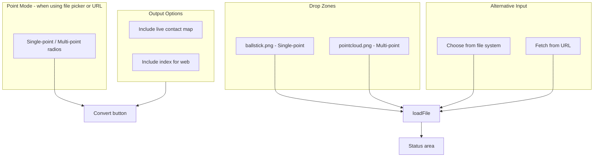

# Drop Zone and Options UI Redesign

## Summary

Replace the single drop zone with two rectangular image drop zones that visually indicate file type and auto-select conversion mode. Split the options panel so point mode selection is separate from output options (live contact map, web index).

## Current Structure

- Single drop zone ([index.html](index.html) lines 21–27) with shared `#file-input`
- Options panel ([index.html](index.html) lines 45–77) groups point mode radios, LCM checkbox, and index checkbox together
- [main.js](src/main.js): drop zone triggers `fileInput.click()`; `loadFile` → `acceptText`; convert reads `point-mode`, `live-contact-map`, `include-index`
- Images: [image/ballstick.png](image/ballstick.png), [image/pointcloud.png](image/pointcloud.png)

## Target Layout

## Implementation Plan

### 1. Replace single drop zone with two image drop zones

**HTML** ([index.html](index.html)):

- Remove the single `#drop-zone` div.
- Add two drop zones side by side:
  - `#drop-zone-ballstick`: `` plus caption "Ball & stick (single-point)"
  - `#drop-zone-pointcloud`: `` plus caption "Point cloud (multi-point)"
- Each zone is a drop target and clickable. Use two hidden file inputs (`#file-input-ballstick`, `#file-input-pointcloud`) so that clicking a zone opens the picker and sets mode based on which zone was clicked.

**JS** ([src/main.js](src/main.js)):

- Add `loadFile(file, mode)` where `mode` is `'single_point'` or `'multi_point'`.
- For drop: `drop-zone-ballstick` drop → `loadFile(file, 'single_point')` and check `#mode-single`; `drop-zone-pointcloud` drop → `loadFile(file, 'multi_point')` and check `#mode-multi`.
- For click: ballstick zone → `file-input-ballstick.click()`; pointcloud zone → `file-input-pointcloud.click()`. On `change`, read the file and set the corresponding mode before calling `loadFile`.
- `acceptText` stays mode-agnostic; mode is applied in the drop/change handlers.

### 2. File picker and URL flows

- Keep the existing "Choose from file system" input (`#file-input`) and URL fetch.
- These flows do **not** auto-set point mode. User must use the point mode radios.
- No changes to `acceptText` or URL fetch logic; they continue to call `acceptText` without setting mode.

### 3. Split options into two sections

**HTML** ([index.html](index.html)):

- **Point mode section** (only relevant when file came from picker/URL): Keep the existing radios in a small block. Optional label: "Point mode (for file picker or URL)".
- **Output options section**: New card/block with only:
  - "Include live contact map vertices" (LCM)
  - "Include index for web viewing"
- Remove the single `#options-panel` wrapper that groups everything; use two distinct blocks (e.g. `point-mode-section`, `output-options-panel`).

**CSS** ([styles/main.scss](styles/main.scss)):

- Replace `#drop-zone` styles with styles for `.drop-zone-image` (or similar) used by both zones.
- Style the two zones as a flex row (e.g. `display: flex; gap: 1rem`) with equal-width columns.
- Images: `object-fit: cover` or `contain`, fixed height (e.g. 120–150px), dashed border, `cursor: pointer`, `drag-over` state.
- Keep `#output-options-panel` (or equivalent) styling similar to current `#options-panel`.

### 4. Update `syncLcmVisibility`

- [ui.js](src/ui.js) `syncLcmVisibility` already disables LCM when multi-point is selected. No change needed; it will continue to work with the radios.

## File Changes Summary

| File                                 | Changes                                                                                                                                       |
| ------------------------------------ | --------------------------------------------------------------------------------------------------------------------------------------------- |
| [index.html](index.html)             | Replace single drop zone with two image drop zones; split options into point mode + output options; add two hidden file inputs for drop zones |
| [src/main.js](src/main.js)           | Wire two drop zones (drag + click), pass mode into `loadFile` for drop/zone-click flows; file picker and URL unchanged                        |
| [styles/main.scss](styles/main.scss) | New styles for dual drop zones; update/rename options panel styles                                                                            |

## Image Paths

- Use `/image/ballstick.png` and `/image/pointcloud.png` (Vite serves from project root).
- Ensure `image/` is included in the build (e.g. place in `public/` or import so Vite bundles them).

